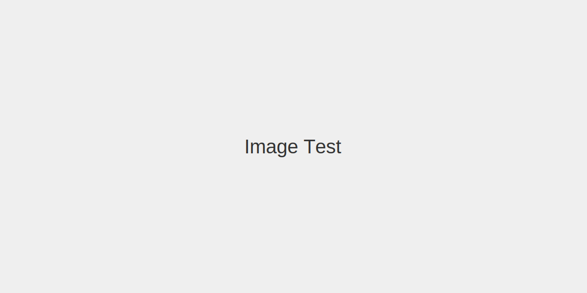

This post demonstrates adding an image as a page bundle resource.

You can also reference this image in templates via Page Resources:


{{ $img := .Resources.GetMatch "image.svg" }}
{{ $res := $img.Fit "800x" }}


