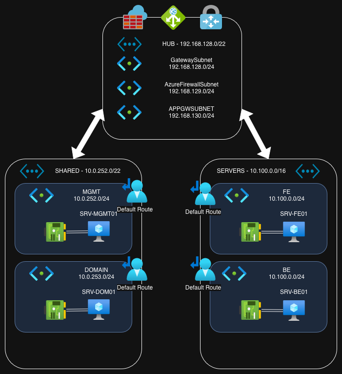

Let's talk about Infrastructure as Code (IaC). We've all read about it and said we would do it. Now, let's actually make some progress.

What the heck am I talking about? Well, it's literally building out your infrastructure out by using some kind of code instead of hand-building everything. This can be done procedurally, where you write code to execute steps along the way to get to the config you want. It can also be done by declaring the desired state and letting a system build it for you. I did the procedural thing back in the day when I built a series of Ansible playbooks to deploy and configure some disaggregated switches. These days, I'm doing more Azure and using the declarative approach using OpenTofu.

OpenTofu is the open-source version of Terraform. To sinfully simplify its function, you write up some config files using the Hashicorp Configuratation Language (HCL) and tell OpenTofu to analyze the config, plan what needs to be done, and make a series of API calls to Azure to deploy everything. Once deployed, OpenTofu keeps track of the state of each resource you created to detect any changes and know what needs to be changed when the config files are updated.

Yes, OpenTofu supports more than just Azure configs. I've used OpenTofu to push out Docker containers. Read their docs for information.

So, what are we going to do? I've made up a simple Azure deployment that we'll tackle.

- Two VNets for servers, each with 2 subnets

- A hub VNet

- VNet peering from each server VNet to the hub

- A single Ubuntu server in each server subnet

- An Azure firewall

- An application gateway

- A VPN gateway

It looks something like this.

We won't deploy them all at once. We'll break it down into sections - the base networking, the compute, then the services.

We'll start off by quickly going over how to install OpenTofu, get it set up, and log into Azure. That'll be exciting. /s Next, we'll add the VNets, the subnets, and the peerings. After the VNets are created, we'll create some VMs (which can be a bit more complicated than you would think). Once all that is up and running, we'll add a firewall and a user-defined route table to send traffic to and from the firewall. Finally, we'll add the application gateway and VPN gateways - probably in different posts.

What won't we do? We're not going to discuss each Azure resource in great detail. I'm trying to keep this focused on OpenTofu and IaC topics as opposed to Azure topics. Of course, some of the configurations will need a bit of explanation along the way
